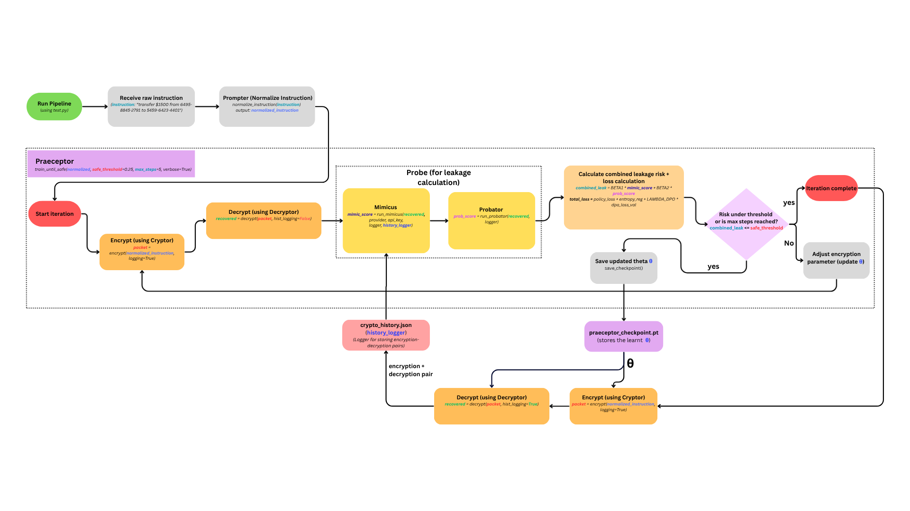

# Shruvaan MCP Pipeline

A secure, adaptive cryptographic pipeline for processing financial instructions with dynamic leakage prevention and privacy-preserving encryption.

## 🏗️ Architecture Overview

Shruvaan MCP is a multi-stage pipeline that processes natural language financial instructions through normalization, encryption, adaptive training, and security validation. The system uses machine learning to dynamically adjust cryptographic parameters to minimize information leakage while maintaining functionality.

### Core Components

- **Prompter**: Natural language instruction normalization
- **Cryptor**: Advanced encryption with key derivation functions
- **Decryptor**: Secure decryption with proof validation
- **Mimicus**: Adversarial model for testing information leakage
- **Probator**: Statistical analysis for risk assessment
- **Praeceptor**: Adaptive training system that trains and updates theta of the cryptor to change the encryption, making it stronger when leakage crosses the threshold

## 📁 Repo Structure

```
SHRUVAAN_MCP/
│
├─ assets/                  # images, plots, media
│
├─ utils/                   # helper code
│   ├─ audit_logger.py
│   ├─ crypto_history_logger.py
│   ├─ llm_client.py
│   └─ plotter.py
│
├─ venv/                    # virtual environment
│   ├─ .env
│   └─ .env.example
│
├─ .gitignore
├─ audit_log.json             # general purpuse logger
├─ crypto_history.json        # encryption-decryption history logger
├─ cryptor.py
├─ decryptor.py
├─ mimicus.py
├─ policy.py
├─ praeceptor_checkpoint.pt   # stores trained theta
├─ praeceptor.py
├─ probator.py
├─ prompter.py
├─ Readme.md
├─ requirements.txt
└─ test.py                    # for running the pipeline

```

## 🈺 Shruvaan Code Flow

[](https://www.canva.com/design/DAGeOYKP3Xk/eoyLb7qAl62SU44uliwDJA/view?utlId=h78e9a98d01)

## 🚀 Quick Start

### Prerequisites

```bash
# Required environment variables
export GEMINI_API_KEY="your-gemini-api-key"
# Alternative: OPENAI_API_KEY or GROQ_API_KEY
```

### Installation

```bash
pip install -r requirements.txt
```

### Basic Usage

```bash
python test.py
```

## 🔄 Pipeline Flow Overview

This section explains the complete lifecycle of a request through the Shruvaan MCP pipeline, showing where execution begins, what each stage consumes and produces, and what gets logged.

### 1. Entry Point: `test.py`

**Functionality**: Orchestrates the entire pipeline from raw instruction → normalized → encrypted → decrypted → adaptive training → re-encrypt/probe.

**Key Inputs**:
- `instruction` (str): Natural language command (e.g., "transfer $1500 from 6395-8845-2791 to 6559-6423-4401")
- Environment variables: `GEMINI_API_KEY` (or OpenAI/Groq if swapped)

**Key Outputs**:
- Pretty-printed JSON dumps at each stage
- Unified audit log (`audit_log.json`)

---

### 2. Normalization Stage (Promptor)

**Entry Function**: `normalized = p.normalize_instruction(instruction)`
(`Prompter.normalize_instruction`)

**Input**: Natural language string instruction

**Process**:
- Uses LLM (provider = Gemini/OpenAI/Groq) to parse and normalize into structured JSON
- Adds control metadata (role, epoch, policy, raw_instruction)

**Output**:
```json
{
  "action": "transfer",
  "amount": 1500,
  "currency": "$",
  "from_account": "6395-8845-2791",
  "to_account": "6559-6423-4401",
  "policy": "≤10000",
  "role": "TellerAgent",
  "epoch": "2025-09-22T16:58:18.092735+00:00",
  "raw_instruction": "transfer $1500 from ..."
}
```

**Logging**: Normalization logs go to `audit_log.json`

---

### 3. Encryption Stage (Cryptor)

**Entry Function**: `packet = c.encrypt(normalized)`
(`Cryptor.encrypt`)

**Input**: Normalized JSON instruction

**Process**:
1. Generate random hctx + salt
2. Derive Fernet key via HKP KDF (+ θ if provided)
3. Encrypt each field key and value recursively
4. Compute Proof-of-Possession (PoP = SHA256 over canonical JSON + role + epoch)
5. Assemble packet { enc_map, pop, metadata }

**Output**: Encrypted packet with structure preserved
```json
{
  "enc_map": { "<ciphertext-key>": "<ciphertext-value>", "..." },
  "pop": "abc123...",
  "metadata": {
    "kdf": {"hctx": "...", "salt": "..."},
    "role": "TellerAgent",
    "epoch": "..."
  }
}
```

**Logging**:
- hctx, salt, and θ logged via AuditLogger
- Crypto history stored via CryptoHistoryLogger

---

### 4. Decryption Stage (Decryptor)

**Entry Function**: `recovered = d.decrypt(packet)`
(`Decryptor.decrypt`)

**Input**: Encrypted packet (enc_map, pop, metadata)

**Process**:
1. Retrieve hctx + salt from packet (or AuditLogger if absent)
2. Rebuild Fernet key (θ included)
3. Recursively decrypt keys and values
4. Validate PoP

**Output**: Original normalized JSON

**Logging**:
- Decryption success/fail logged in `audit_log.json`
- Plaintext ↔ ciphertext pairs recorded in `crypto_history.json`

---

### 5. Adaptive Training (Praeceptor – Internally uses Mimicus and Probator)

**Entry Function**: `result = praeceptor.train_until_safe(normalized, safe_threshold=0.25, max_steps=50)`

**Input**:
- `normalized` → plaintext JSON instruction (from Prompter)
- `safe_threshold` → maximum tolerated leakage (default: 0.25)
- `max_steps` → maximum training iterations

---

**Process**:

#### 1. Encrypt + Decrypt Loop
- For each iteration, Praeceptor asks the Cryptor to encrypt using current θ
- Decryptor recovers the plaintext back

#### 2. Leakage Probing (Mimicus & Probator)

##### a. Mimicus
**Entry Function**: `result = run_mimicus(decrypted, packet, provider, api_key, logger, history_logger)`

**Inputs**:
- `decrypted`: current plaintext instruction
- `packet`: encrypted JSON packet
- `history_logger`: provides history of (encrypted, decrypted) pairs for context

**Process**:
- Uses LLM-based probing to mimic the decryption function
- Looks at historical mappings between encrypted → decrypted from CryptoHistoryLogger
- Attempts to guess the decrypted content of the new packet without access to the key
- Produces leakage metrics:
  - `entity_recovery` (how many entities guessed)
  - `structural_fidelity` (JSON structure matched)
  - `semantic_drift` (difference from ground truth)
  - `leakage_score` (aggregate risk score)

**Output Example**:
```json
{
  "mimic_fields": { "intent": "transfer", "entities": {...} },
  "components": {
    "entity_recovery": 1.0,
    "structural_fidelity": 1.0,
    "semantic_drift": 0.004,
    "leakage_score": 0.79
  },
  "decision": "raise_risk"
}
```

##### b. Probator
**Entry Function**: `result = run_probator(decrypted, packet, logger)`

**Inputs**:
- `decrypted`: current plaintext instruction
- `packet`: encrypted JSON packet

**Process**:
- Uses statistical heuristics and prefix/ngram analysis to probe ciphertext
- Detects scaffold leakage, injection vulnerability, or structural regularities
- Produces probabilistic leakage score `Rprob`

**Output Example**:
```json
{
  "L_ngram": 0.033,
  "L_prefix": 0.0,
  "L_inject": 1.0,
  "L_scaffold": 0.5,
  "Rprob": 0.38
}
```

#### 3. Theta Update (Feedback Loop)
- Praeceptor combines Mimicus `leakage_score` and Probator `Rprob` into a combined leakage risk
- If risk > safe_threshold → updates θ vector
- Calls `cryptor.set_theta(updated_theta)` to directly inject the new parameters into Cryptor
- Re-runs encryption/decryption with updated θ

#### 4. Termination
- Stops when leakage < threshold OR when max steps reached

---

**Output**:
```json
{
  "success": true,
  "final_theta": [0.47, 0.61, 0.52, 0.49, 0.55],
  "history": [
    { "step": 0, "mimic": 0.79, "prob": 0.38, "theta": [0.50, 0.50, 0.50, 0.50, 0.50] },
    { "step": 1, "mimic": 0.42, "prob": 0.21, "theta": [0.47, 0.61, 0.52, 0.49, 0.55] }
  ]
}
```

---

**Logging**:
- Each probe result (Mimicus, Probator) logged
- Each θ update logged by Praeceptor
- CryptoHistoryLogger maintains encrypted ↔ decrypted pairs for use by Mimicus
- Unified export to `audit_log.json` at end of run

---

### 5. Export Logs

**Entry Function**: `logger.export("audit_log.json")`

**Output**: Final unified audit log combining normalization, encryption, decryption, θ updates, Mimicus/Probator evaluations

**Purpose**: Ensures full traceability for audits and research

---

## 📊 Data Flow Summary

```
Instruction (str)
   ↓
Prompter.normalize → normalized JSON
   ↓
Praeceptor.train_until_safe → (Mimicus + Probator probes → leakage/risk reports) → updates θ
   ↓
Cryptor.encrypt → encrypted packet (+KDF metadata, PoP)
   ↓
Decryptor.decrypt → plaintext recovery
   ↓
plotter.plot_all → plot all the relevent graphs
   ↓
Audit log export

```

## 📁 File Structure

### Generated Files
- `audit_log.json` - Unified audit trail for all operations
- `crypto_history.json` - Plaintext ↔ ciphertext mapping history

### Key Components
- `prompter.py` - Natural language normalization
- `cryptor.py` - Encryption/decryption engine
- `mimicus.py` - Adversarial leakage testing
- `probator.py` - Statistical risk analysis
- `praeceptor.py` - Adaptive training system (trains and updates theta of the cryptor to change the encryption, making it stronger when leakage crosses the threshold)
- `test.py` - Main pipeline orchestrator (it runs the full pipeline starting from prompter)

## 🔧 Configuration

### LLM Providers
The system supports multiple LLM providers:
- **Gemini** (default): Set `GEMINI_API_KEY`
- **OpenAI**: Set `OPENAI_API_KEY` 
- **Groq**: Set `GROQ_API_KEY`

### Security Parameters
- `safe_threshold`: Maximum acceptable leakage score (default: 0.25)
- `max_steps`: Maximum training iterations (default: 50)
- `θ (theta)`: Dynamic parameter vector for key derivation

## 🛡️ Security Features

- **Proof-of-Possession (PoP)**: Cryptographic integrity verification
- **Adaptive θ Vectors**: Dynamic parameter adjustment based on leakage analysis
- **Recursive Encryption**: Field-level encryption of both keys and values
- **Adversarial Testing**: Continuous validation against information leakage
- **Audit Trail**: Complete operation logging for compliance

## 🐛 Debugging

### Log Analysis
1. Check `audit_log.json` for operation timeline
2. Review `crypto_history.json` for encryption/decryption pairs
3. Monitor console output for real-time pipeline status

### Common Issues
- **API Key Missing**: Ensure environment variables are set
- **High Leakage Score**: Check θ parameter tuning in Praeceptor
- **Decryption Failures**: Verify PoP validation and key derivation

## 🤝 Contributing

### For New Team Members

1. **Start Here**: Run `python test.py` with a sample instruction
2. **Follow the Flow**: Trace execution through each pipeline stage
3. **Check Logs**: Review generated JSON files to understand data transformations
4. **Experiment**: Modify parameters and observe leakage score changes

### Development Guidelines
- All operations must be logged for audit compliance
- Security parameters should be configurable
- Maintain backward compatibility in encryption/decryption
- Add comprehensive tests for new components

## 📈 Performance Metrics

The system tracks several key metrics:
- **Leakage Score**: Information disclosure risk (lower is better)
- **Training Iterations**: Steps needed to reach safe threshold
- **Processing Time**: End-to-end pipeline duration
- **Success Rate**: Percentage of instructions processed successfully

## 📞 Support

For questions about the codebase:
1. Review this README and trace through `test.py`
2. Check the generated audit logs for operational details
3. Examine component-specific documentation in source files
